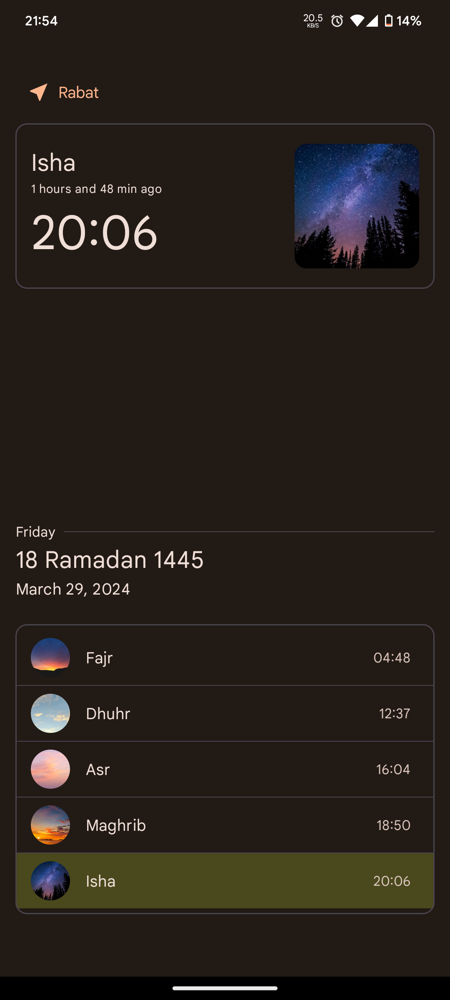
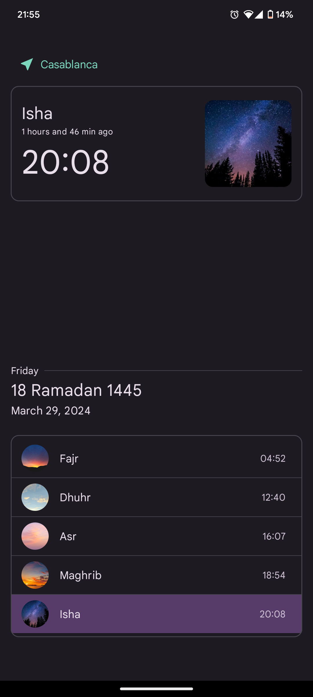

# Moroccan Prayer Times App
This Android application retrieves daily prayer times for Moroccan cities using the official API provided by the Ministry (Habous and Waqf) - http://www.habous.gov.ma/.

## Features
- Displays Fajr, Dhuhr, Asr, Maghrib, and Isha prayer times for today.
- Allows selection of different Moroccan cities.
- Use Dynamic colors

      

## Download apk
[Download apk file](https://github.com/El-Ahmed/PrayerTime/raw/master/app/release/app-release.apk)

## ko-fi
Donate here [ko-fi](https://ko-fi.com/elahmed)
